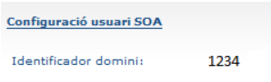
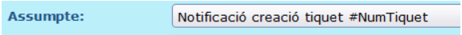

<!-- Copy and paste the converted output. -->

<!-----
NEW: Check the "Suppress top comment" option to remove this info from the output.

Conversion time: 2.722 seconds.


Using this Markdown file:

1. Paste this output into your source file.
2. See the notes and action items below regarding this conversion run.
3. Check the rendered output (headings, lists, code blocks, tables) for proper
   formatting and use a linkchecker before you publish this page.

Conversion notes:

* Docs to Markdown version 1.0β31
* Fri Oct 01 2021 04:42:54 GMT-0700 (PDT)
* Source doc: Guia ràpida del MailToTicket
* This is a partial selection. Check to make sure intra-doc links work.
* Tables are currently converted to HTML tables.
* This document has images: check for >>>>>  gd2md-html alert:  inline image link in generated source and store images to your server. NOTE: Images in exported zip file from Google Docs may not appear in  the same order as they do in your doc. Please check the images!

----->


<p style="color: red; font-weight: bold">>>>>>  gd2md-html alert:  ERRORs: 0; WARNINGs: 0; ALERTS: 4.</p>
<ul style="color: red; font-weight: bold"><li>See top comment block for details on ERRORs and WARNINGs. <li>In the converted Markdown or HTML, search for inline alerts that start with >>>>>  gd2md-html alert:  for specific instances that need correction.</ul>

<p style="color: red; font-weight: bold">Links to alert messages:</p><a href="#gdcalert1">alert1</a>
<a href="#gdcalert2">alert2</a>
<a href="#gdcalert3">alert3</a>
<a href="#gdcalert4">alert4</a>

<p style="color: red; font-weight: bold">>>>>> PLEASE check and correct alert issues and delete this message and the inline alerts.<hr></p>


## Guia ràpida   \
del Mailtoticket


## <p style="text-align: right">


<p id="gdcalert1" ><span style="color: red; font-weight: bold">>>>>>  gd2md-html alert: inline image link here (to images/image1.png). Store image on your image server and adjust path/filename/extension if necessary. </span><br>(<a href="#">Back to top</a>)(<a href="#gdcalert2">Next alert</a>)<br><span style="color: red; font-weight: bold">>>>>> </span></p>


</p>


## 1. Característiques {#1-característiques}

MailToTicket és una passarel·la de correu per al sistema de gestió de tiquets GN6, amb les característiques següents:


* Permet crear tiquets a partir d’un simple correu electrònic que compleixi unes condicions determinades.
* Incorpora fitxers adjunts al correu dins de la pestanya d’annexos del GN6.
* Busca l’usuari al servei d’identitat digital a partir del remitent i permet diferents solucions en cas que no el trobi.
* Afegeix comentaris al tiquet quan detecta que el correu rebut és una resposta a un tiquet ja creat. Identifica els comentaris interns.
* Pot reobrir els tiquets tancats, o crear-ne de nous si ha passat el termini.
* Pot crear tiquets amb paràmetres diferents segons les capçaleres del missatge (per exemple: equip resolutor, sol·licitant, urgència...).
* Pot classificar tiquets en funció de paraules clau dins de l’assumpte del missatge.


<p id="gdcalert2" ><span style="color: red; font-weight: bold">>>>>>  gd2md-html alert: inline image link here (to images/image2.png). Store image on your image server and adjust path/filename/extension if necessary. </span><br>(<a href="#">Back to top</a>)(<a href="#gdcalert3">Next alert</a>)<br><span style="color: red; font-weight: bold">>>>>> </span></p>


## 2. Instal·lació {#2-instal·lació}

Aquest document descriu el procediment d’instal·lació en un servidor amb sistema operatiu GNU/Linux. S’ha provat amb en Ubuntu Server 14.04, però hauria de funcionar sense problemes en altres distribucions.

Tot i que no és estrictament necessari, us recomanem crear un usuari només per a la instal·lació de MailToTicket. No cal que aquest usuari tingui privilegis d’administrador.


### 2.1. Dependències i versions {#2-1-dependències-i-versions}

MailToTicket és una aplicació desenvolupada en Python, amb els següents requisits:


* Python 2.7
* Els següents mòduls de Python:
  * beautifulsoup4
  * bleach
  * mock>=1.3.0
  * suds
  * discover
* virtualenv
* fetchmail
* Git


### 2.2. Programari {#2-2-programari}

El codi de MailToTicket està disponible a GitHub. La forma recomanada d'instal·lació és dins d'un _virtualenv_ de Python per poder gestionar les dependències de mòduls sense que calgui tenir permisos d'administrador.

Normalment les distribucions basades en Debian ja porten una versió de Python 2.x instal·lada per defecte. Per tant només caldria instal·lar alguns paquets addicionals:


```
$ sudo apt-get install virtualenv fetchmail git
```


Ara ja podeu instal·lar MailToTicket executant les següents ordres des del vostre directori `$HOME`:


```
$ git clone https://github.com/UPC/mailtoticket.git
$ cd mailtoticket
$ virtualenv local
$ echo "PATH=$PWD/local/bin:\$PATH" >> ~/.bashrc
$ source ~/.bashrc
$ pip install -r requirements.txt
```


Un cop fet això, s’haurà descarregat el programari de MailToTicket al subdirectori `$HOME/mailtoticket`, tindreu configurat un entorn de Python per al vostre usuari, independent del que tingueu al vostre sistema, i s’hauran instal·lat els mòduls de Python necessaris per a MailToTicket.

Encara caldrà configurar MailToTicket perquè pugui començar a funcionar.


L’apartat [3.3. Configurar la instància de GN6 a Mailtoticket](#3-3-configurar-la-instància-de-gn6-a-mailtoticket) explica els canvis mínims que cal fer al fitxer de configuració de MailToTicket, i l’apartat [3.4. Configuració de la bústia](#3-4-configuració-de-la-bústia) explica com configurar _fetchmail_ per tal d’associar MailToTicket a una bústia de correu.


## 3. Configuració {#3-configuració}


### 3.1. Requisits {#3-1-requisits}


#### 3.1.1. Accés als _webservices_ necessaris {#3-1-1-accés-als-webservices-necessaris}

Cal demanar a l’ÀTIC l’accés a ambdós _webservices_, creant un tiquet per a cada petició a través d’aquest [formulari de sol·licitud](https://gn6.upc.edu/atic/control/peticioUsuariAlta?peticioPlantillaId=10510). Recomanem que les següents sol·licituds les faci directament el vostre personal de suport TIC.

L’accés al _webservice_ “GestioIdentitat - Persones” és necessari per deduir, si és possible, el nom d’usuari UPC dels remitents dels missatges partir de les seves adreces de correu. A continuació es mostra un exemple de les dades que cal donar en aquesta sol·licitud:


* Sistema d'informació consumidor: **MailToTicket de la unitat X**
* Usuari / Grup Intranet: **nom.cognom.soa**
  * Aquest és el vostre usuari d’accés al SOA (si ja havíeu demanat anteriorment accés a algun _webservice_ del SOA, ja teniu un usuari SOA i el podeu fer servir aquí també).
* Persones de contacte (nom, tfn, email): **Nom Cognom, 401XXXX, nom.cognom@upc.edu**
* Finalitat: **Deduir la identitat d'un usuari UPC a partir del seu correu electrònic.**
* Bus privat/públic: **Privat**
* URL servei explotació: **https://public.bus-soa.upc.edu/GestioIdentitat/Personesv6?wsdl**
* IP accés bus explotació: **147.83.abc.xyz**
  * Adreça IP del servidor on instal·lareu _MailToTicket_.
* URL servei test: **https://public.bus-soades.upc.edu/GestioIdentitat/Personesv6?wsdl**
* IP accés bus test: **147.83.abc.xyz**
  * Adreça IP del servidor on instal·lareu _MailToTicket_.
* Operacions: **llistaPersones, obtenirDadesPersona**
* Horari: **24x7**
* Estimació d’ús: **20 peticions per hora**
* Acceptació política d’ús: **Sí**

L’accés al _webservice_ “GN6 - GestioTiquets” és necessari per crear i modificar tiquets a la vostra instància de GN6. Cal introduir les mateixes dades que al formulari anterior excepte les següents:


* Finalitat: **Crear, consultar i modificar tiquets al GN6 des d'una instància de _MailToTicket_.**
* URL servei explotació: **https://bus-soa.upc.edu/gN6/GestioTiquetsv5?wsdl**
* URL servei test: **https://bus-soades.upc.edu/gN6/GestioTiquetsv5?wsdl**
* Operacions: **totes**


#### 3.1.2. Accés a la instància GN6 via SOA {#3-1-2-accés-a-la-instància-gn6-via-soa}

És necessari obrir un nou tiquet a l’ÀTIC. Aquesta petició és millor que la faci alguna de les persones autoritzades com a responsables de la vostra instància de GN6; també ho pot demanar una altra persona, però llavors caldrà que prèviament ho autoritzi algun responsable.

A continuació es mostra un exemple del correu que cal enviar, tot i que serà necessari que canvieu el nom i la _URL_ pels valors adients de la vostra instància de GN6:


```
Benvolguts, benvolgudes,

Sol·licitem un usuari i contrasenya per a poder accedir via SOA (webservice "GN6 - GestioTiquets") a la instància "XXXXX" del GN6 (https://gn6.upc.edu/XXXXX).

Ben cordialment,

Nom Cognom
```


#### 3.1.3. Identificador de domini i de l’equip resolutor {#3-1-3-identificador-de-domini-i-de-l’equip-resolutor}

Serà necessari obtenir de la nostra instància de GN6 dues dades: l’identificador numèric del nostre domini (és a dir, el número únic que identifica la nostra instància) i l’identificador numèric de l’equip resolutor (que és aquell equip al que s’assignen els tiquets nous). Així doncs:


* Per trobar l’identificador de domini és necessari permisos d’administrador i anar a la pestanya Administració -> Domini -> Dades generals; allà, a l’apartat “Configuració usuari SOA” es trobarà indicat com a “Identificador domini”:


<p id="gdcalert3" ><span style="color: red; font-weight: bold">>>>>>  gd2md-html alert: inline image link here (to images/image3.png). Store image on your image server and adjust path/filename/extension if necessary. </span><br>(<a href="#">Back to top</a>)(<a href="#gdcalert4">Next alert</a>)<br><span style="color: red; font-weight: bold">>>>>> </span></p>





* Per trobar l’identificador de l’equip resolutor cal anar a la pestanya “Equips i persones” i accedir al menú lateral “Consulta d’equips”. Allà cercarem l’equip resolutor que volguem i farem clic al nom: l’identificador de l’equip el veure’m a l’URL; marcat en negreta en aquest exemple: \

  * htttps://gn6.upc.edu/persones/control/equipDetall?equip=**98765**& ...


### 3.2. Configurar plantilles {#3-2-configurar-plantilles}


    El MailToTicket busca a l’assumpte del correu l’identificador del tiquet per poder afegir el comentari. Per això és important revisar que els següents missatges continguin el camp: #NumTiquet a l’assumpte.


* Missatge de creació de tiquet
* Missatge intern de tiquet notificat
* Missatge de tancament de tiquet

  En cas de no tenir-ho, ho haureu d’incorporar:

* Exemple de missatge de creació de tiquet:


<p id="gdcalert4" ><span style="color: red; font-weight: bold">>>>>>  gd2md-html alert: inline image link here (to images/image4.png). Store image on your image server and adjust path/filename/extension if necessary. </span><br>(<a href="#">Back to top</a>)(<a href="#gdcalert5">Next alert</a>)<br><span style="color: red; font-weight: bold">>>>>> </span></p>





    Per a qualsevol altre missatge que es faci servir, també s’haurà de incorporar el camp: #NumTiquet a l’assumpte.


    Exemples:

* Missatge de creació de tiquet en cas d’usuari extern
* Missatge d’associació sol·licitant (per a tiquets amb més d’un sol·licitant)
* Missatge de tancament massiu


### 3.3. Configurar la instància de GN6 a Mailtoticket {#3-3-configurar-la-instància-de-gn6-a-mailtoticket}

Per fer funcionar MailToTicket, haureu de tenir un fitxer de configuració anomenat `settings_default.py`. A la distribució de l’aplicació en tenim un d’exemple, així que el podeu agafar com a plantilla.


```
$ cp settings_sample.py settings_default.py
```


A partir d’aquí, veurem el mínim a tocar per que funcioni.


#### 3.3.1. Configuració bàsica: usuaris SOA, domini i equip resolutor {#3-3-1-configuració-bàsica-usuaris-soa-domini-i-equip-resolutor}

Ara es el moment de revisar que hagueu fet tot l’apartat 3.1. Necessitareu l’usuari i la contrasenya SOA (per accedir al bus) i l’usuari i la contrasenya per accedir a GN6 via SOA. Suposeu que aquests usuaris i contrasenyes són:


* **Usu.soa** / **secret**
* **Usugn6** / **trustno1**

Suposeu també que l’identificador del vostre domini és **1234** i que voleu que els tiquets vagin per defecte a l’equip resolutor **98765**, tal i com heu vist als exemples anteriors.

Llavors l’haureu d’editar el `settings_default.py` per que quedi així...


```
settings = {

    # Usuaris SOA i GN6
    "username_soa": "usu.soa",
    "password_soa": "secret",
    "username_gn6": "usugn6",
    "password_gn6": "trustno1",

    # Instància de GN6 on voleu crear els tiquets
    "domini": "1234",

    # Equip resolutor per defecte amb què s'han de crear els tiquets
    "equip_resolutor_nous": "98765",
```


La resta de valors els deixareu tal com estan. La resta de valors també són configurables, però per ara teniu la funcionalitat més bàsica de MailToTicket per comprovar que tot funciona.


#### 3.3.2. Prova de funcionament {#3-3-2-prova-de-funcionament}

En aquests moments, la nostra instància de GN6 ja hauria d’estar preparada per funcionar conjuntament amb MailToTicket i MailToTicket ja té totes les dades per crear els tiquets i consultar la informació dels usuaris. Només queda comprovar que tot encaixa.

Creeu un petit missatgel de prova i el guardeu com a **<code>mail.txt</code></strong>. És important canviar l’adreça <strong>nom.cognom@upc.edu</strong> per l’adreça de correu que teniu al servei de directori de la UPC: pot ser una adreça @upc.edu o bé d’unitat, però ha de ser el que consta al servei de directori.


```
From: <nom.cognom@upc.edu>
To: <suport.unitat@upc.edu>
Date: Tue, 20 Oct 2015 11:01:05 +0200
Subject: Benvingut, mailtoticket!

Hola!

Mailtoticket ja pot crear tickets!
```


Ara ja podem executar MailToTicket passant aquest fitxer com el missatge d’entrada. Abans però, assegureu-vos que teniu creat el directori on anirà el registre de canvis.


```
$ mkdir $HOME/logs
$ cat mail.txt | python mailtoticket.py
```


Si tot va bé, haurem d’obtenir en pantalla el mateix text que hem escrit amb una capçalera **X-Mailtoticket: SUCCESS **al principi. També haurem de veure al registre de canvis que s’ha creat un tiquet (surten moltes línies, aquí només posem les essencials).


```
$ cat $HOME/tmp/mailtoticket.log
INFO 	---------------------------------------------------------------
INFO 	Llegeixo mail
INFO 	Mail de nom.cognom@upc.edu llegit amb ID None
INFO 	Entro a mailtoticketBenvingut, mailtoticket!
INFO 	Vaig a provar filtres [<filtres.reply.FiltreReply object at 0x2b81e7e31f10>, <filtres.nou.FiltreNou object at 0x2b81e7e31e90>]
…
INFO 	Ticket creat
…
INFO 	Ja he fet el que havia de fer. Surto!
INFO 	Marco el mail com a tractat
```


I lògicament la prova última de què tot va bé és que s’haurà creat un tiquet a nom vostre amb el text que heu posat, que haurà quedat assignat a l’equip de resolutors que hagueu configurat.

Si veieu que algun d’aquests passos falla, haureu de revisar que hagueu posat correctament els valors dels usuaris i contrasenyes. Probablement el fitxer registre de canvis podrà donar alguna pista del que ha anat malament.

Ara que ja teniu la confirmació de que el MailToTicket pot llegir els missatges i crear tiquets, heu de fer que els pugui llegir i processar directament de la bústia.


### 3.4. Configuració de la bústia {#3-4-configuració-de-la-bústia}

Com que cada unitat té una forma diferent de processar els correus de suport, en aquest punt se’n documenta una de determinada però això no vol dir que sigui l’única possible.


#### 3.4.1. Flux de treball {#3-4-1-flux-de-treball}

Preneu com a exemple predeterminat el flux de treball següent:


* Els missatges de peticions noves no es processaran automàticament.
* Una persona de l’equip de suport revisa periòdicament aquests missatges a la bústia d’entrada i els mou a la carpeta **mailtoticket** si considera que s’han de tractar.
* Les respostes a les notificacions dels tiquets es mouran automàticament a la carpeta mailtoticket gràcies als filtres del servidor de correu.
* El MailToTicket es connectarà al servidor de correu i processarà els missatges que trobi a la carpeta **mailtoticket**. Un cop processats correctament els eliminarà.

El primer que ens cal tenir és una bústia de correu amb accés IMAP. Totes les bústies del correu UPC ho són, així que suposeu que l’adreça és **[suport.unitat@upc.edu](mailto:suport.unitat@upc.edu)**. A través de l’usuari suport.unitat del **correu.upc.edu** podreu configurar els filtres de la bústia de correu que permetran decidir com s’han de processar els missatges de suport i les respostes.

Finalment, us caldrà configurar l’accés al servidor de correu amb el protocol IMAP i programar que se’n faci el processament cada cert temps.


#### 3.4.2. Filtre de còpia de seguretat {#3-4-2-filtre-de-còpia-de-seguretat}

Aquesta regla permet tenir una còpia de tots els correus que tinguin definit un assumpte per tal que puguem disposar-ne en cas que es produeixi algun error durant el processament o si cal investigar un problema passat un temps. Tingueu present que us caldrà fer neteja de la carpeta **backup** periòdicament.


* Menú:** Correu** -> **Filtres**
* **Nova regla**
* Nom de la regla: **<code>Còpia de seguretat</code></strong>
* Per a cada missatge d'entrada que coincideixi amb: <strong>TOT</strong>
* Seleccioneu un camp: <strong>Assumpte</strong> -> <strong>Existeix</strong>
* Fer això: <strong>Deixar a la carpeta</strong> -> <strong>Crear carpeta</strong> -> <strong><code>backup</code></strong>
* Marcar el missatge com a: <strong>No per totes les opcions</strong>
* Voleu aturar la comprovació si aquesta regla coincideix? <strong>No</strong>
* <strong>Desar</strong>


#### 3.4.3. Filtre de correu processat {#3-4-3-filtre-de-correu-processat}

Aquesta regla s’utilitza com a salvaguarda per evitar que es processin els missatges que el MailToTicket ja ha tractat prèviament. Per fer-ho comprova les capçaleres del correu.


* Menú:** Correu** -> **Filtres**
* **Nova regla**
* Nom de la regla: **<code>Processats amb èxit pel MailToTicket</code></strong>
* Per a cada missatge d'entrada que coincideixi amb: <strong>TOT</strong>
* Seleccioneu un camp: <strong>Capçalera auto-definida</strong> -> <strong><code>X-Mailtoticket</code></strong> -> <strong>Conté</strong> -> <strong><code>SUCCESS</code></strong>
* Fer això: <strong>Deixar a la carpeta</strong> -> <strong>Crear carpeta</strong> -> <strong><code>processats</code></strong>
* Marcar el missatge com a: <strong>Eliminat</strong>
* Voleu aturar la comprovació si aquesta regla coincideix? <strong>Sí</strong>
* <strong>Desar</strong>


#### 3.4.4. Filtre de detecció de respostes {#3-4-4-filtre-de-detecció-de-respostes}

Per detectar si un missatge és una resposta a una notificació del GN6 es comprova el valor de les capçaleres del correu ja que és un mètode més fiable que mirar el contingut de l’assumpte (els diferents clients de correu canvien l’assumpte de formes diverses a l’hora de respondre).


* Menú:** Correu** -> **Filtres**
* **Nova regla**
* Nom de la regla: **<code>Carpeta del MailToTicket</code></strong>
* Per a cada missatge d'entrada que coincideixi amb: <strong>TOT</strong>
* Seleccioneu un camp: <strong>Capçalera auto-definida</strong> -> <strong><code>X-Mailtoticket</code></strong> -> <strong>No existeix</strong>
* i: <strong>Capçalera auto-definida</strong> -> <strong><code>In-Reply-To</code></strong> -> <strong>Expressió regular</strong> -> <strong><code>.*-tiquet-id-[0-9]+@gn6</code></strong>
* Fer això: <strong>Deixar a la carpeta</strong> - <strong>Crear carpeta</strong> -> <strong><code>mailtoticket</code></strong>
* Marcar el missatge com a: <strong>Eliminat</strong>
* Voleu aturar la comprovació si aquesta regla coincideix? <strong>Sí</strong>
* <strong>Desar</strong>


#### 3.4.5. Processament periòdic del correu {#3-4-5-processament-periòdic-del-correu}

Creeu un fitxer **<code>~/.fetchmailrc</code></strong> amb mateix lloc on heu instal·lat el MailToTicket i amb les línies següents:


```
poll imap.upc.edu proto imap:

username  "suport.unitat"
password  "contrasenya"
folder    "mailtoticket"
mda       "$HOME/mailtoticket/local/bin/python $HOME/mailtoticket/mailtoticket.py >/dev/null"
ssl
nokeep
```


Finalment, per programar la comprovació del correu de la carpeta **mailtoticket**, per exemple cada 5 minuts, heu d’executar l’ordre **<code>crontab -e</code></strong> i afegir les línies següents:


```
MAILTO=mailtoticket@unitat.upc.edu
*/5 * * * * /usr/bin/fetchmail --silent
```


## 


## 4. Més informació {#4-més-informació}

Aquest és document una guia ràpida per poder posar en marxa mailtoticket, però hi ha moltes més opcions de configuració que no estan contemplades en aquest manual.

Pots obtenir més informació a:


* [https://github.com/UPC/mailtoticket](https://github.com/UPC/mailtoticket)
* [http://mailtoticketupc.blogspot.com.es/](http://mailtoticketupc.blogspot.com.es/)
